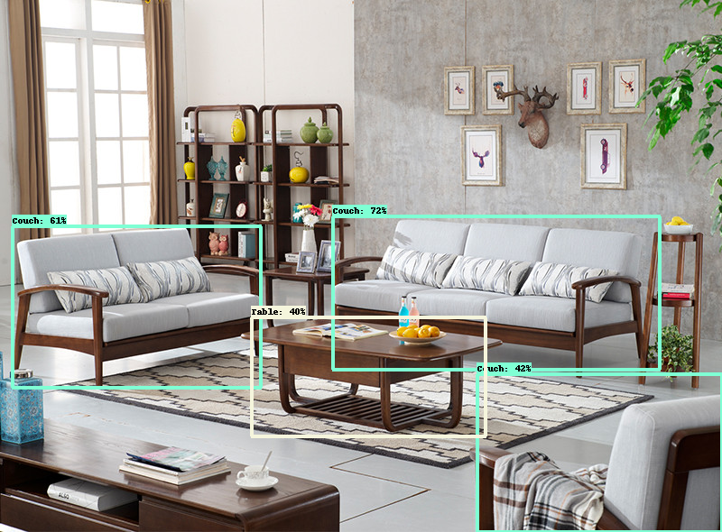

# Furniture Object Detection

## Dataset
We collect images dataset from OpenImagesv6
and convert to TFRecords.

## Model
We train EfficientDet-D0 using TensorFlow Object Detection API.

## Deployment
Model deployed using Docker.
## Demo
We also create app demo using streamlit.